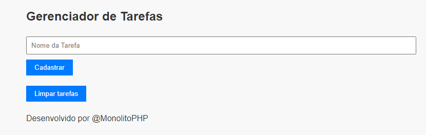

# Gerenciador de Tarefas

Este é um simples gerenciador de tarefas em HTML e PHP.

## Funcionalidades
- Adicionar uma nova tarefa
- Visualizar lista de tarefas cadastradas
- Limpar todas as tarefas cadastradas

## 🔧 Funcionalidades de PHP
- `isset()`: Verifica se uma variável está definida.
- `$_SESSION`: Armazena informações de sessão do usuário.
- `foreach`: Itera sobre arrays ou objetos de forma eficiente.
- `session_start()`: Inicia ou resuma uma sessão para armazenar variáveis de sessão.
- `array()`: Cria um novo array em PHP.
- `$_GET`: Coleta dados enviados via parâmetros de URL.
- `array_push()`: Adiciona elementos no final de um array.
- `var_dump()`: Exibe informações sobre variáveis para depuração.
- `unset()`: Destrói uma variável e remove seu conteúdo da memória.

## Desenvolvimento
Este projeto foi desenvolvido por @MonolitoPHP.

## Licença
Este projeto é de código aberto e pode ser utilizado livremente.

